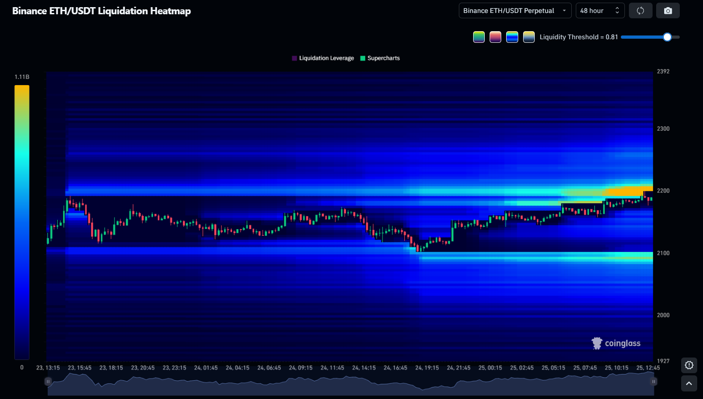

# CoinglassAutoRefreshBrowserScript
A Code-Snippet for the Browsers console, to auto refresh the liquidation heatmap on: https://www.coinglass.com/pro/futures/LiquidationHeatMapNew

## Screenshot



## How to Use

This script works on every browser console. To open the console, normally press **F12** and then click on **Console**.

If console pasting is blocked, type the following into the console first and press Enter:

```
allow pasting
```

Then copy the code from the file `coinglassautorefresher.js`, change the `intervalSeconds` value if needed to fit your preferences, and paste it into the console window. The script will run automatically after entering it.

> **Please note:** Auto-refresh is normally a premium feature. If you find this useful, please consider buying the prime subscription. This is just a testing script for developers.

## Script (30-second interval)

```js
const intervalSeconds = 30;

const hideLoading = () => {
  // Progress bar
  const progress = document.querySelector('.cg-style-9c5vqi');
  if (progress) progress.style.display = 'none';

  // Blur overlay
  const overlay = document.querySelector('.cg-style-1scqz9h');
  if (overlay) overlay.style.display = 'none';
};

const autoRefresh = setInterval(() => {
  const btn = document.querySelector('button.cg-style-nb177x');

  if (btn) {
    btn.click();
    console.log(`[AutoRefresh] Clicked at ${new Date().toLocaleTimeString()}`);
    // Wait briefly for elements to appear, then hide them
    setTimeout(hideLoading, 300);
    setTimeout(hideLoading, 600);
    setTimeout(hideLoading, 1000);
    setTimeout(hideLoading, 2000);
  } else {
    console.warn('[AutoRefresh] Button not found!');
  }
}, intervalSeconds * 1000);

console.log(`[AutoRefresh] Started – every ${intervalSeconds} seconds.`);
// To stop: clearInterval(autoRefresh)
```

The full script is also available in `coinglassautorefresher.js`.
